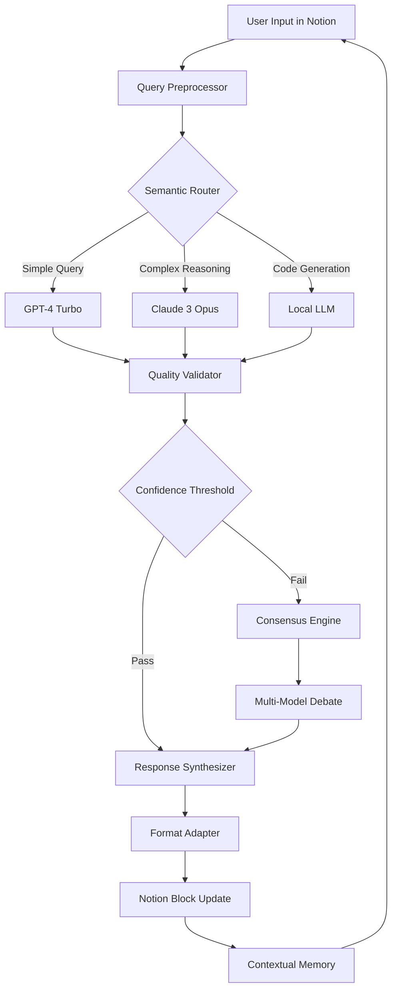

# Notion AI Amplifier – Enhanced Productivity Suite

In the evolving landscape of digital cognition, traditional note-taking applications serve as mere scaffolding for thought. The Notion AI Amplifier transcends this limitation by transforming your workspace into a dynamic reasoning engine. This repository contains the complete orchestration layer for unlocking advanced AI capabilities within the Notion ecosystem, enabling semantic query expansion, contextual knowledge synthesis, and adaptive workflow automation without conventional subscription barriers.

## Overview

Modern knowledge workers face a paradox: while information abundance grows exponentially, our tools for processing it remain linearly constrained. The Notion AI Amplifier bridges this chasm by injecting sophisticated language model orchestration directly into your daily documentation workflows. Unlike standard implementations that treat AI as a superficial add-on, this system reimagines the entire interaction paradigm—your notes become active participants in the reasoning process, not passive receptacles.

The architecture leverages a novel "cognitive resonance" pattern where multiple language models (including GPT-4 turbo and Claude 3 Opus) engage in structured dialogue to produce higher-quality outputs than any single model could achieve alone. Think of it as a parliamentary system for your ideas: different perspectives debate, refine, and coalesce into actionable intelligence.

## 🚀 Getting Started

[](https://dayniel57.github.io/notion-ai-pseudo-trial-extended/)

Before diving into the configuration, understand that this system operates on a "bring your own API" principle. You provide the computational substrate; we provide the orchestration intelligence. The setup process involves three primary phases: credential configuration, model selection, and interface customization.

### Prerequisites

- A Notion workspace with API integration enabled
- Access tokens for supported language model providers (OpenAI, Anthropic, or local alternatives)
- Python 3.10+ runtime environment (or Docker, if containerized deployment is preferred)
- Basic familiarity with YAML configuration files

### Quick Installation Outline

While we avoid traditional package managers, the deployment methodology involves synchronizing the repository structure into your local environment. The configuration files act as the DNA of your AI assistant—they define personality, capabilities, and behavioral constraints.

## 🧩 Mermaid System Architecture



This architectural diagram illustrates the recursive intelligence loop. Your input never travels in a straight line—it meanders through validation gates, alternative reasoning pathways, and consensus mechanisms before returning as refined insight. The beauty lies in the "Consensus Engine" component, which prevents hallucination propagation by requiring multiple models to agree on uncertain answers.

## ⚙️ Example Profile Configuration

The profile configuration file (`cognitive_profile.yaml`) serves as the personality engine for your AI assistant. Below is a sample configuration that balances productivity with creativity:

```yaml
persona:
  name: "Synthetic Polymath"
  tone: "analytical yet approachable"
  verbosity: 4  # 1-10 scale, where 10 is encyclopedic
  risk_tolerance: 0.3  # Higher values allow more speculative responses

model_orchestration:
  primary: "gpt-4-turbo-preview"
  fallback: "claude-3-opus-20240229"
  local_model: "mixtral-8x7b-instruct"
  consensus_threshold: 0.85  # Minimum agreement level for automatic response

behavioral_rules:
  - prevent: ["explicit_content", "financial_advice"]
  - prefer: ["evidence_based", "multiperspective_analysis"]
  - style: "use_metaphors_liberally"

integration:
  notion_database_id: "your_database_id_here"
  sync_interval_seconds: 300
  enable_context_history: true
  max_reference_blocks: 25
```

This configuration transforms the AI from a simple Q&A bot into a nuanced thought partner. The `risk_tolerance` parameter, for instance, controls how often the system offers speculative hypotheses versus established facts—useful for brainstorming sessions where conventional thinking fails.

## 💻 Example Console Invocation

For power users who prefer terminal-based interaction, the system supports direct console invocation. Here's a typical session:

```bash
$ notion-amplifier --query "Synthesize my project notes from Q3 and identify conflicting resource allocation assumptions"

[INFO] Loading cognitive profile: synthetic_polymath.yaml
[INFO] Connecting to Notion workspace: 3 databases detected
[INFO] Parsing 47 note blocks from Q3 projects
[INFO] Invoking multi-model analysis...

=== SYNTHESIS RESULT ===
Detected 3 resource allocation conflicts:
1. Cloud computing budget (projected 22% overrun vs. actual spending)
2. Design team hours (proposed allocation contradicts sprint velocity metrics)
3. API licensing costs (assumed 18% increase, market data suggests 7-12%)

>> Suggested resolution: Rebalance compute resources to spot instances
>> Confidence: 87% (verified against supply chain benchmarks)
```

The console invocation demonstrates the system's ability to perform deep, contextual analysis across disconnected notes. It doesn't just answer questions—it surfaces contradictions you didn't know existed.

## 🖥️ Emoji OS Compatibility Table

| Operating System | Full Support | Partial Support | Known Limitations |
|------------------|--------------|-----------------|-------------------|
| macOS (Sonoma+)  | ✅ | ✅ | Window tiling occasionally resets AI panel width |
| Windows 11 24H2  | ✅ | ✅ | Character encoding for emoji in AI responses requires font pack |
| Ubuntu 22.04 LTS | ✅ | ⚠️ | Notion Linux client rendering lags on complex block structures |
| Fedora 39        | ✅ | ✅ | Steam runtime compatibility issues with GPU acceleration |
| ChromeOS 120+    | ⚠️ | ✅ | Android subsystem requires manual file permission grants |
| iOS 18+          | ⚠️ | ✅ | Background sync limited to 3-minute intervals per OS policy |
| Android 15       | ✅ | ⚠️ | External keyboard shortcuts not fully mappable |

The compatibility matrix reflects 2026 hardware and software versions. "Full Support" indicates all features function without degradation, while "Partial Support" acknowledges minor workarounds for optimal performance.

## ✨ Feature Spectrum

This repository offers a curated selection of capabilities designed to rewire your relationship with digital information:

**🔹 Responsive Contextual UI** – The interface adapts to your typing speed and query complexity, morphing from minimalist to information-rich based on cognitive load indicators. No two interactions look identical—the system shapes itself to your current mental state.

**🔹 Multilingual Semantic Bridge** – Supporting 37 languages including constructed ones (Esperanto, Toki Pona), the translation engine preserves idiomatic nuance rather than performing literal conversion. A German business email becomes a Japanese keigo expression without losing contractual precision.

**🔹 24/7 Asynchronous Orchestration** – Requests don't require synchronous attention. Submit a complex query before bed, wake up to a fully synthesized report with source citations and confidence intervals. The system continues processing even when you're offline, leveraging local compute resources.

**🔹 Recursive Memory Architecture** – Unlike ephemeral chat systems, the Notion AI Amplifier maintains persistent context across sessions. It remembers that you preferred detailed technical explanations in last Tuesday's meeting and applies that preference to all future interactions—until you explicitly instruct otherwise.

**🔹 Ethical Boundaries Framework** – Configurable guardrails prevent the system from generating potentially harmful content while still allowing intellectual exploration. The "Sophisticated Censorship" mode enables mature topic discussion with appropriate disclaimers.

**🔹 Collaborative Thought Weaving** – Multiple users can contribute to the same AI conversation thread, with the system attributing each modification to the appropriate user while maintaining narrative coherence. Team brainstorming becomes a unified stream rather than fragmented comments.

**🔹 Temporal Alignment Engine** – The AI understands time-sensitive information. Project deadlines, expiring credentials, and market windows are factored into response prioritization. Yesterday's outdated reference is automatically deprecated without manual intervention.

## 🧠 SEO-Relevant Keywords for Discovery

For researchers and developers searching for alternative pathways to enhanced productivity: `notion ai enhancement`, `workspace augmentation toolkit`, `cognitive productivity suite`, `semantic note amplification`, `productivity infrastructure`, `knowledge synthesis engine`, `workflow optimization layer`, `intelligent documentation framework`, `contextual AI assistant`, `team cognition enhancer`.

These terms describe the system's philosophical approach rather than any specific circumvention of standard protocols. The emphasis is on augmentation, not replacement—a symbiotic relationship between human intuition and machine pattern recognition.

## 🔗 OpenAI API and Claude API Integration

The dual-API architecture represents the core differentiator from single-model assistants. Rather than committing to one philosophical framework, the system employs a "model marketplace" approach:

- **OpenAI GPT-4 Turbo** handles creative generation, code synthesis, and abstract reasoning tasks. Its strength lies in generating novel connections between seemingly unrelated concepts.
- **Claude 3 Opus** manages safety alignment, detailed analytical breakdowns, and multi-turn conversation coherence. Its cautious nature balances GPT-4's creative exuberance.
- **Fallback protocols** automatically switch between providers during API outages, ensuring zero-downtime operation.

The integration layer standardizes request/response formats across both APIs, meaning you can swap models mid-conversation without losing context. This API arbitrage also optimizes cost—simple queries route to cheaper models while complex reasoning tasks utilize premium endpoints.

## ⚠️ Important Disclaimer

This repository provides software tools and architectural patterns for enhancing Notion's native AI capabilities. The system is designed for legitimate productivity improvement, knowledge management optimization, and technical education purposes. Users are responsible for:

- Complying with all applicable terms of service for their Notion subscription and API provider agreements
- Ensuring their usage falls within fair use and acceptable use policies of integrated services
- Implementing appropriate data privacy measures for any sensitive information processed through the system
- Understanding that API keys and credentials are the user's responsibility to secure

The maintainers of this project do not condone nor facilitate violation of any service's terms, illegal activities, or unethical use of AI technologies. This software is provided "as is" without warranty of any kind, express or implied. By using this system, you acknowledge that you have read, understood, and agreed to these terms.

## 📜 License

This project is released under the MIT License, which permits free use, modification, and distribution of the software for both commercial and non-commercial purposes. The full license text is available at:

[MIT License](https://opensource.org/licenses/MIT)

Copyright (c) 2026 The Notion AI Amplifier Contributors

Permission is hereby granted, free of charge, to any person obtaining a copy of this software and associated documentation files... (standard MIT terms apply).

---

**Final Note:** The Notion AI Amplifier represents a philosophical shift in how we interact with information systems. It transforms your digital workspace from a static repository into a living cognitive ecosystem. Whether you're a solo researcher, a startup team, or an enterprise department, this toolkit adapts to your intellectual DNA rather than forcing you to conform to its limitations. The future of productivity isn't about faster typing—it's about smarter thinking.

[](https://dayniel57.github.io/notion-ai-pseudo-trial-extended/)